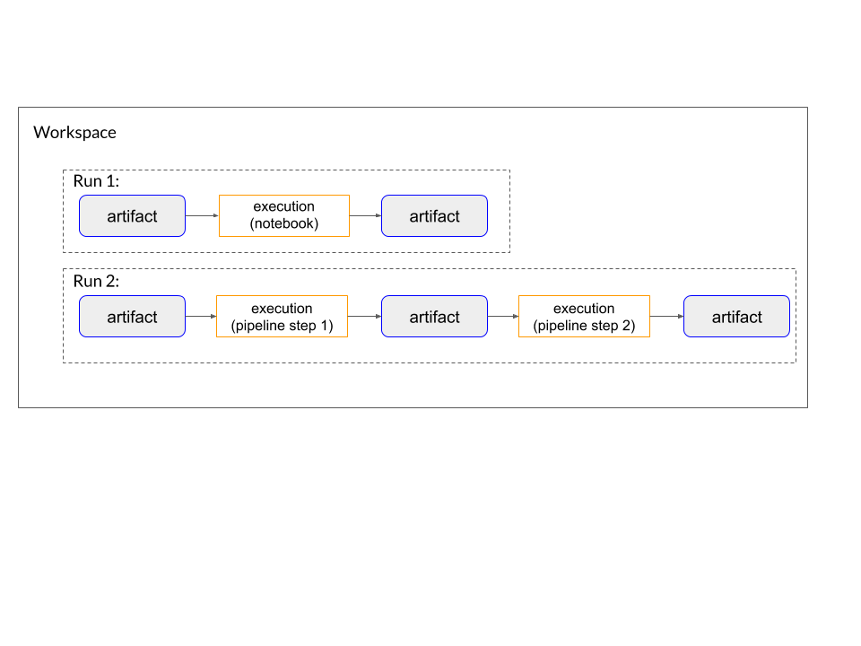

# Python Library

This directory conatins Python API for logging metadata of machine learning workflows to Kubeflow Metadata service.

## Installation

You can install this Python library for logging metadata via the following command:
```
pip install kfmd
```

## Concepts
- _Run_ describes an execution of a machine learning workflow, which can be a pipeline or a notebook.
- _Artifact_ describes derived data used or produced in a run.
- _Execution_ describes an execution of a single step of a run with its running parameters.
- _Workspace_ groups a set of runs and related artifacts and executions.

## Sample Usage
See .


