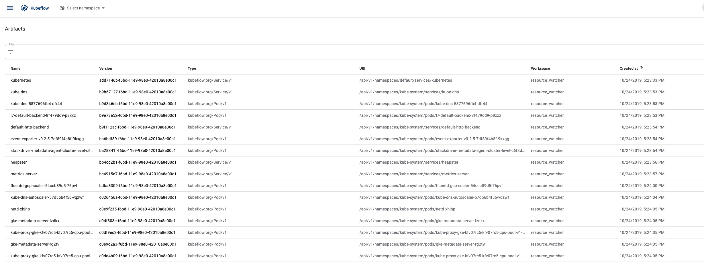
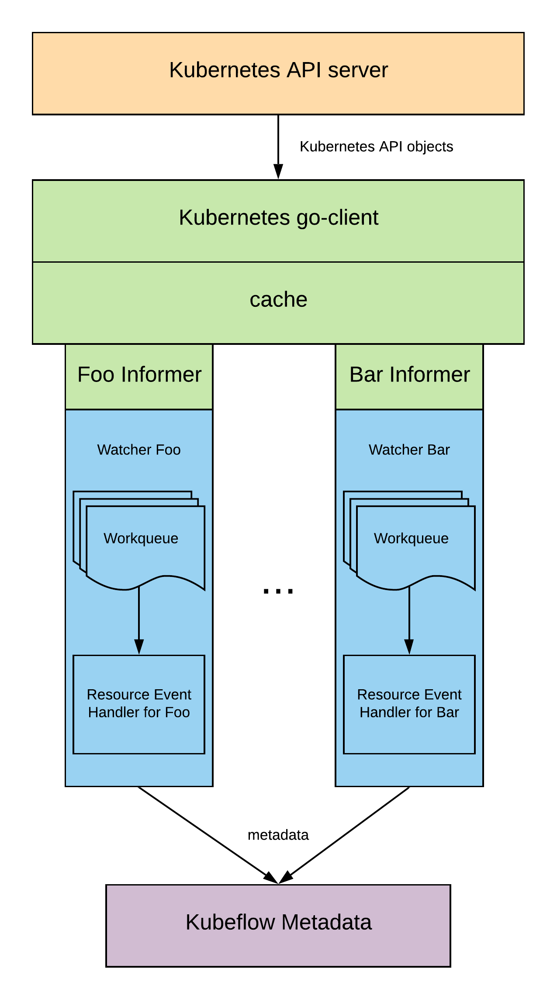

A metadata watcher extracts metadata from some type of Kubernetes API objects and log to Kubeflow Metadata service. Besides logging metadata via SDK, the watchers provide an additional way to log metadata regardless where the data is generated.

### Installation
1. Install Kubeflow Metadata component with [gRPC service](https://github.com/kubeflow/manifests/blob/master/metadata/base/metadata-service.yaml), which is installed by default for Kubeflow with versin >= 0.7.0
2. Run `make deploy` to deploy a watcher pod into your Kubeflow cluster.

### Generic watcher
Current watcher can watch the creation of any Kubernetes resouce object anc extract basic information. Only `pod` and `service` resource are watched by default. You can add more resource definition or even customized resource definition into [its config](https://github.com/kubeflow/metadata/blob/master/watcher/dockerfiles/resource_list.json).

After you deploy the watch, you can see the metadata about the `pod` and `service` from the Artifact Store page in Kubeflow Central Dashboard.

### How to extend
If you want to create your own watcher, you only need to create a handler that
1. registers a metadata type for your resource,
2. parses the Kubernetes resource definiton, and
3. extracts metadata from resource definitiona and logs it as your defined type.

A good example is the [generic watcher handler](https://github.com/kubeflow/metadata/blob/master/watcher/handlers/metalogger.go).

### Architecture
The architecture is shown below.

